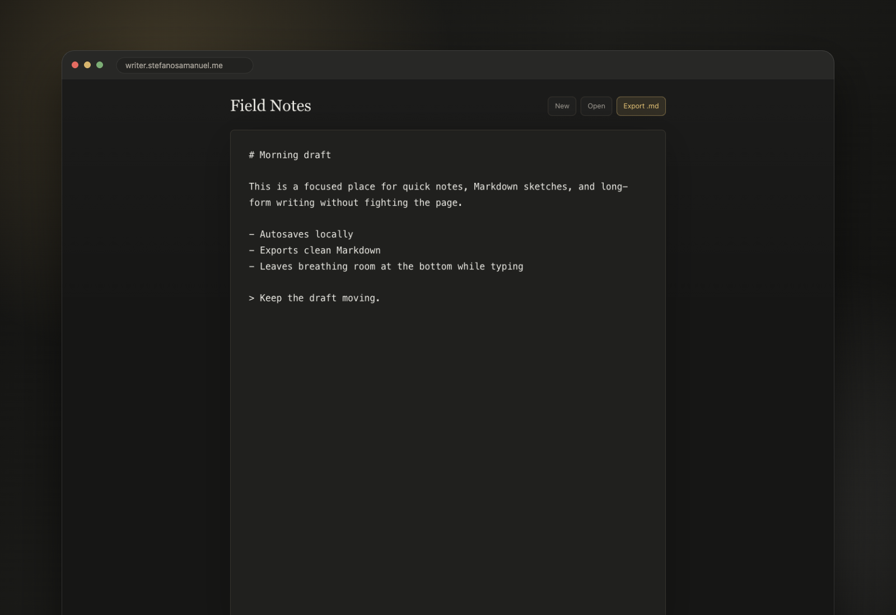

# writer

A focused Markdown writing app for quick notes and longer drafts.

Hosted at [writer.stefanosamanuel.me](https://writer.stefanosamanuel.me).



## Features

- Native textarea editing with browser selection, scrolling, paste, and mobile behavior
- Local autosave and restore
- Markdown export as `.md`
- Open or drag in `.md`, `.markdown`, and `.txt` files
- Word count, character count, and cursor position

## Development

```sh
npm install
npm run dev
```

## Production

```sh
cp .env.example .env
npm run build
docker-compose up -d --build
```

Set `WRITER_HOST` in `.env` to the hostname that Traefik should route.

## Notes

This fork has been substantially rewritten from the original custom-rendered editor into a smaller Markdown drafting app.
The original project did not include a license file in this repository history; add or confirm licensing before publishing as a reusable open source project.
